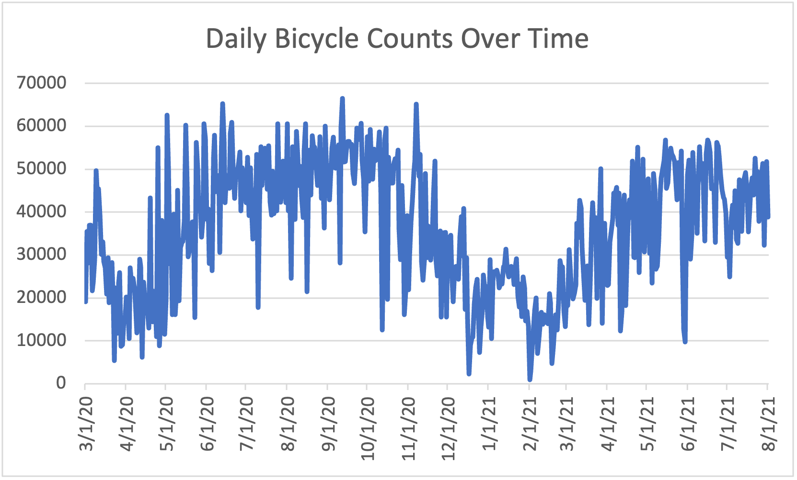

# COVID-19’s impact on the NYC Traffic
## Yilin Shan, Jason Yu
&nbsp;
## Abstract
The World Health Organization later announced COVID-19 a global pandemic in March 2020.
Similar works have been done regarding how urban transportation activity changes in response to disruptive events, however, it is still unclear how specifically New York City’s traffic is being impacted during the pandemic. To investigate that, our group conducted analytics based on Hadoop MapReduce and Hive as well as data visualizations on datasets of New York City’s daily new covid cases, bicycle records, and other transportation methods. We found out that the overall cycling activity in the city increased during the pandemic and the cycling activity is negatively correlated to the number of new covid case. Besides, the vaccination could be contributing to the significant increase in average bicycle counts from April 2021. Finally, we were pleased by the observation that the city’s public transportations were steadily recovering, with the road traffics being nearly its pre-pandemic level. We believe these findings would be helpful for addressing the urban residents’ concern of pandemic and for implementing future public health policies in similar environments.
 
Introduction
In mid-December 2019, a cluster of patients in Wuhan, China began to experience shortness of breath and fever. The mysterious virus that caused such symptoms quickly spread through the provinces of China in the following months. By February, outbreaks had emerged in multiple countries. The World Health Organization later announced the official name for the disease: COVID-19, declaring it a global pandemic.

It is clear that the pandemic has caused a substantial disturbance in nearly every aspect of society, but transportation is arguably one of those that are being impacted the greatest, especially in metropolitans like New York City. Due to the implementation of various measures to control the spread like travel restrictions and lockdowns, the participants of NYC traffic plummeted as people were seeking different methods of commuting or simply switching to remote working. 

Obviously, the COVID-19 has greatly disrupted the city’s traffic pattern, but it is still not clear that to what extent the pattern has been altered compared to its pre-pandemic state. Gaining an understanding of how different means of transportation change in NYC as the pandemic progresses is critical for better responses to a similar public health crisis in other urban areas in the future.

Project Design
We attempted to use applications of the Hadoop ecosystem to analyze traffic activity changes of NYC to take advantage of their ability to process large datasets efficiently. Specifically, we used MapReduce to clean as well as to profile the input datasets. After the cleaned datasets were obtained, we imported them to Hive to perform queries for the purpose of our analytics. Finally, data visualizations across datasets were conducted to provide additional insights besides Hive. The analytic design diagram is shown in Fig.1.

&nbsp;
&nbsp;


Fig.1

&nbsp;

## Motivation:
As residents of NYC and active participants of local transportation, we could genuinely relate to how strong the pandemic has impacted individuals’ routine and mental health due to stress caused by major lifestyle changes. To help address the NYC residents’ concerns about the COVID-19 pandemic, our group collect data from various public sources and perform data processing and analysis with a tech stack building on the powerful Hadoop ecosystems.
We hope our data-driven analysis of the pandemic’s effects on NYC transportation helps the residents sustain and improve their well-being during these unprecedented times.

## Related Work:
Interpreting the transportation activity responds to unprecedented disruptive events has been a topic of substantial interest. For instance, traffic activity changes pertaining to extreme natural events have been examined in NYC during the time of Hurricane Sandy (Donovan et al. 2017). By analyzing a dataset of taxi trips in the city, the study identified and quantified levels of anomaly from start to end of the event. Besides, Lee et al. (2020) investigated the relationship between the fluctuation in traffic volume and the trend of COVID-19 in South Korea. The authors applied single linear regression and find a relationship between the changing number of confirmed COVID-19 cases and the traffic trend. However, given that South Korea was implementing less strict public health measures like not restricting outdoors excursions and the potentially huge difference in commuting choices between South Korea residents and NYC residents, we deemed it reasonable and necessary to conduct analytics in NYC’s case.

## Datasets
Our Bicycle Counts data is 174.4MB data that consists of 4.24 million rows showing the counting result of the number of bicycles among labeled locations in each borough of New York City for recent years. The columns include a unique id for each event, the date a count is conducted, the counting result, whether the data recorded is valid, and the choice of sites. The data is created in 2019 and has been updated monthly. The dataset is downloaded from NYC open data. The provider of this data is the Department of Transportation (DOT).

Our dataset on the trend of COVID-19 is also obtained from NYC Open Data. The dataset is a 115kb csv file that displays 647 rows of daily counts of the confirmed COVID cases, hospitalized COVID patients, and COVID-related death cases in New York City. The data was created and provided by the Department of Health and Mental Hygiene (DOHMH) in April 2020 and has been updated daily. 

Our third dataset is the day by day ridership numbers provided and updated weekly by Metropolitan Transportation Authority (MTA). The dataset, with a size of 53KB, lists the daily percentage of traffic change compared to the year before the COVID pandemic started and the estimated number of ridership and traffic flow on multiple transportation means which include subways, buses, LongIsland Rail Road, Metro-North Railroad, Access-A-Ride and Bridges and Tunnels. 

## Analytic Stages
We first performed data cleaning with MapReduce on datasets  Bicycle_Counts.csv and  COVID-19_Daily_Counts_of_Cases__Hospitalizations__and_Deaths.csv. Specifically, unrequired columns and records with null fields were identified and dropped. Besides, the date fields in the two datasets were rewritten to the standard format to be prepared for later analytics. This step generated the two cleaned datasets:  bi.csv and  covid.csv, respectively. 

We then created  bi_sum.csv  by summing bicycles every 15 mins from a single day to get the total number of bicycles that day. To gain a deeper understanding of the cycling activity changes during COVID-19, we further performed MapReduce on bi_sum.csv to calculate the % Change of bicycle numbers from the pre-pandemic equivalent day, and this step would generate  bi_change.csv.

After preprocessing all the datasets, we imported the two cleaned datasets to Hive for analytics. All the queries we performed are shown at the ending page. Some queries performed to bi_sum.csv yield the key statistics like sums, averages, maximum and minimum of bicycle numbers recorded in NYC before (March 2019 to August 2020) and during (March 2020 to August 2021) the pandemic. Similar queries were performed to covid.csv. The key statistics for the two datasets are shown in Fig.2 and Fig.3. 


Fig.2

&nbsp;

Fig.3


Some valuable insights we gained from the analytics are as follows:
1.  Both sum and average bicycle counts increased during the pandemic compared to that of the same period the year before. One potential explanation for this might be that more commuters switch from public transportation to cycling for health concerns (better social distancing).
2.  Average bicycle counts increased significantly from April 2021. This observation corresponds to the event that from the end of March, NYC’s vaccination eligibility was finally broadened to people 16 years and older, which previously being 30 years and older. The increased vaccination eligibility might encourage more people to participate in local traffic.
3.  During the pandemic, a negative correlation of -0.634 was obtained between the bicycle counts and the daily new covid infection count. This corresponds to the findings yielded by the three join queries: As the new daily covid case increases from 1500 to 4500, the average bicycle counts drop from 24372 to 21826. This is quite intuitive since the more severe the pandemic has become, the more people would prefer staying at home to going outside.

Besides Hive queries, we performed data visualization on all three datasets and gained some additional insights. The resulting 3 graphs are Fig.4, Fig.5, and Fig.6.
1.  Fig.4 and Fig.6 corresponds to each other pretty well as whenever one graph changes the other one moves in the opposite direction, which supports our observation that bicycle counts and the daily new covid infection case are negatively correlated, and we hypothesized that the seasonal changes in weather and temperature might play an important role.
2.  When comparing Fig.4 to Fig.5, we observed that all three methods of transportation experienced a drastic decrease in ridership at the beginning of the pandemic. However, as the pandemic progresses, all three methods are generally recovering despite the spike of the new covid infections in January 2021. The road traffics recovered especially well as it was nearly pre-pandemic level in July and August. We tended to attribute the fast recovering to the vehicles’ ability to maintain better social distancing over public transportations.

&nbsp;

Fig.4

&nbsp;

Fig.5 (orange line-Subways, blue line-Buses, gray line-Road Traffics)

&nbsp;

Fig.6

&nbsp;

## Conclusions
In conclusion, this analytic presented multiple findings and provided some potential causes for them pertaining to the topic of how the COVID-19 has affected different measures of NYC’s transportation activities.

We found that overall cycling activities increase during the pandemic, and it could potentially be due to cycling being a good way to maintain a better practice of social distancing.

Besides, the broadened eligibility of vaccination to people 16 years and older could contribute to the significant increase in average bicycle counts at that time.

Additionally, both Hive analytics and data visualization support the finding that the level of cycling activity is negatively correlated to the number of covid case.

Finally, public transportations of subways, buses, and road traffics all plummeted at the beginning of the pandemic, but all three measures were recovering steadily, with the road traffics doing especially well to nearly pre-pandemic level.

With all these findings, we believe the study succeeded in its job of bringing insights to the public and addressing their concerns to a certain degree. And for future studies, we believe it would be interesting to investigate what roles did weather and temperature play in covid infections as well as cycling activity since the bicycle counts and new daily covid case count all exhibited some levels of seasonal fluctuations.


## References

Donovan, B., and D. B. Work. 2017. “Empirically quantifying city-scale
transportation system resilience to extreme events.” Transp. Res. Part
C Emerging Technol. 79 (Jun): 333–346. https://doi.org/10.1016/j.trc
.2017.03.002.

Hocheol Lee, Sung Jong Park, Ga Ram Lee, Ji Eon Kim, Ji Ho Lee, Yeseul Jung, Eun Woo Nam, The relationship between trends in COVID-19 prevalence and traffic levels in South Korea, International Journal of Infectious Diseases, Volume 96, 2020, Pages 399-407,
ISSN 1201-9712, https://doi.org/10.1016/j.ijid
.2020.05.031.


## Hive queries (the same as hive_analytics.txt)
```
beeline --silent
!connect jdbc:hive2://hm-1.hpc.nyu.edu:10000/
Use jy2575;

create external table bi_sum (`date` date, `count` int) ROW FORMAT DELIMITED FIELDS TERMINATED BY '\t' STORED AS TEXTFILE;
load data inpath 'hdfs://horton.hpc.nyu.edu:8020/user/jy2575/project_data/bi_sum.csv' overwrite into table bi_sum; 

select * from bi_sum;

Select count(*) from bi_sum where `date` <= '2021-08-01' and `date` >= '2020-03-01';

select sum(count) from bi_sum where `date` <= '2021-08-01' and `date` >= '2020-03-01';
select sum(count) from bi_sum where `date` <= '2020-08-01' and `date` >= '2019-03-01';

select avg(count) from bi_sum where `date` <= '2021-08-01' and `date` >= '2020-03-01';
select avg(count) from bi_sum where `date` <= '2020-08-01' and `date` >= '2019-03-01';

select avg(count) from bi_sum where `date` <= '2021-07-01' and `date` >= '2021-04-01';

select max(count) from bi_sum where `date` <= '2021-08-01' and `date` >= '2020-03-01';
Select * from bi_sum where `count`=66489;

select min(count) from bi_sum where `date` <= '2021-08-01' and `date` >= '2020-03-01';
Select * from bi_sum where `count`=913;


create external table covid (`date` date, `count` int) ROW FORMAT DELIMITED FIELDS TERMINATED BY '\t' STORED AS TEXTFILE;
load data inpath 'hdfs://horton.hpc.nyu.edu:8020/user/jy2575/project_data/covid.csv' overwrite into table covid; 

select * from covid;

select sum(count) from covid where `date` <= '2021-08-01' and `date` >= '2020-03-01';

select avg(count) from covid where `date` <= '2021-08-01' and `date` >= '2020-03-01';

select avg(count) from covid where `date` <= '2021-07-01' and `date` >= '2021-04-01';

select max(count) from covid where `date` <= '2021-08-01' and `date` >= '2020-03-01';

select min(count) from covid where `date` <= '2021-08-01' and `date` >= '2020-03-01';


Select avg(bi_sum.count) from bi_sum join covid on (bi_sum.`date`=covid.`date`) where bi_sum.`date` <= '2021-08-01' and bi_sum.`date` >= '2020-03-01' and covid.count>=1500;
Select avg(bi_sum.count) from bi_sum join covid on (bi_sum.`date`=covid.`date`) where bi_sum.`date` <= '2021-08-01' and bi_sum.`date` >= '2020-03-01' and covid.count>=3000;
Select avg(bi_sum.count) from bi_sum join covid on (bi_sum.`date`=covid.`date`) where bi_sum.`date` <= '2021-08-01' and bi_sum.`date` >= '2020-03-01' and covid.count>=4500;


Select corr(bi_sum.count,covid.count) from bi_sum join covid on (bi_sum.`date`=covid.`date`) where bi_sum.`date` <= '2021-08-01' and bi_sum.`date` >= '2020-03-01'; 
```
